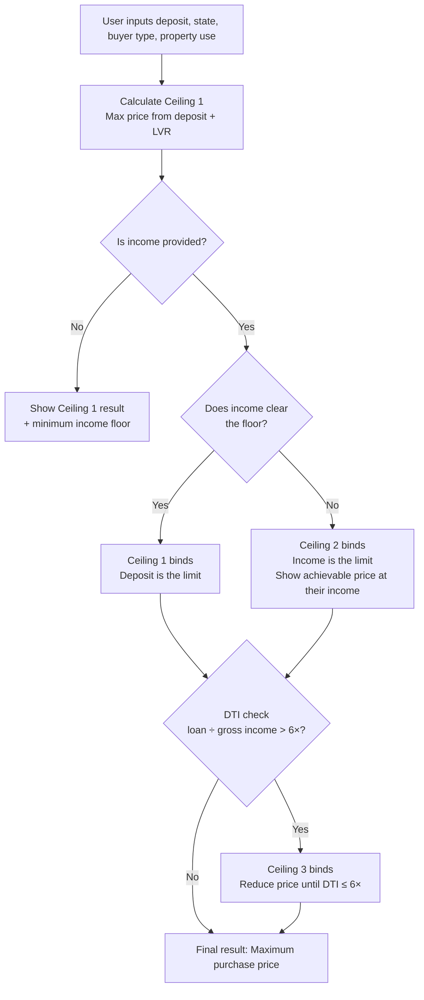

# GetReal — Tool 03: Deposit Floor Checker
## Methodology

**Version:** Draft for expert review  
**Status:** Pre-build. Specific rate figures and table values are pending research and are noted as [TBC]. Feedback on methodology, missing considerations, or structural errors welcome.

---

## Purpose

Most online mortgage calculators answer the wrong question. They calculate a maximum **loan amount** based on income, then leave the user to figure out whether their deposit is sufficient. This tool answers the right question: given a specific deposit (free cash) and personal circumstances, **what is the maximum property price this person can realistically access?**

The distinction matters because upfront costs — primarily stamp duty and Lenders Mortgage Insurance — come directly out of the deposit before it reaches the property. A $100,000 deposit does not translate to $100,000 toward a property purchase.

---

## The three ceilings

Maximum purchase price is bounded by three independent constraints. Whichever is hit first is the binding ceiling.



### Ceiling 1 — Deposit / LVR
The core calculation. The deposit must first absorb upfront costs (stamp duty, transfer fees). The remaining deposit contributes to the property purchase. The resulting loan — including any LMI capitalised on top — cannot exceed a maximum Loan-to-Value Ratio (LVR) set by the lender. This ceiling is calculated iteratively because stamp duty and LMI both move with the property price.

### Ceiling 2 — Serviceability
Even if the deposit supports a given loan, the borrower must be able to service it. This tool does not perform a full serviceability assessment — that requires lender-specific credit policies and a complete financial picture. Instead, it calculates an **income floor**: the minimum net monthly income needed to service the Ceiling 1 loan at the bank's assessment rate, with living expenses at the HEM minimum. If the user's income is below this floor, Ceiling 2 becomes the binding constraint and the tool calculates the purchase price their income does support.

### Ceiling 3 — Debt-to-Income Ratio (DTI)
From February 2026, APRA imposed a binding regulatory cap: a borrower's total new debt cannot exceed **6 times their gross annual income** ([APRA, 2025](https://www.apra.gov.au)). This is checked after Ceiling 1 is calculated. If the loan breaches 6x, the purchase price is reduced until the ratio is within the limit. In practice this ceiling is rarely hit before serviceability fails, but it must be checked.

---

## Ceiling 1 — Calculation in detail

### Overview

The calculation is iterative because its inputs are circular: stamp duty is a function of the property price, and LMI is a function of both the loan amount and LVR — but both are needed before the property price is known. The tool resolves this by stepping through candidate property prices in **$10,000 increments**, testing each one, and returning the highest price at which the effective LVR remains within the lender's maximum.

Property prices are capped at **$5,000,000**. Above this the tool declines to calculate and directs the user to seek advice from a financial planner.

### Step 1 — Stamp duty

Stamp duty is calculated using a **bracket-based algorithm**, not a pre-built lookup table. A formula computes the exact duty at any property price, which is more accurate and maintainable than a table of pre-computed values.

The algorithm follows the structure established by [`ravisha22/PersonalFinanceToolkit`](https://github.com/ravisha22/PersonalFinanceToolkit) (MIT licence), adapted for GetReal with updated 2025-26/2026-27 rates, national coverage, and the $5M calculation cap.

Each state's data is structured as:
```
brackets: [{ min, max, rate, base }]   // marginal bracket table
fhbExemptionThreshold                  // full exemption below this price
fhbConcessionThreshold                 // tapering ends at this price
pprConcession                          // lower brackets for owner-occupiers (VIC)
```

The FHB sliding scale: between the exemption threshold and the concession threshold, duty is prorated — `duty × (price − exemptionThreshold) / (concessionThreshold − exemptionThreshold)`.

A separate data structure exists for each combination of:

- **State/territory** (NSW, VIC, etc.)
- **Property use** (owner-occupier / investment)
- **Buyer type** (first home buyer / non-FHB)
- **Property type** (new build / established)

Tables are pre-computed at $10,000 price increments. At runtime, the tool performs a lookup — not a live calculation — to avoid repeated formula execution during the iterative solve.

**NSW stamp duty brackets — CONFIRMED (2026-27)** ([Revenue NSW](https://www.revenue.nsw.gov.au/taxes-duties-levies-royalties/transfer-duty))

NSW uses the same rate schedule for owner-occupiers and investors. No separate investor rate.

| Property value | Duty payable |
|---|---|
| $0 – $16,000 | $1.25 per $100 |
| $16,001 – $35,000 | $200 + $1.50 per $100 over $16,000 |
| $35,001 – $93,000 | $485 + $1.75 per $100 over $35,000 |
| $93,001 – $351,000 | $1,500 + $3.50 per $100 over $93,000 |
| $351,001 – $1,168,000 | $10,530 + $4.50 per $100 over $351,000 |
| $1,168,001 – $3,505,000 | $47,295 + $5.50 per $100 over $1,168,000 |
| Over $3,505,000 | $175,830 + $7.00 per $100 over $3,505,000 |

**NSW FHB (FHBAS):** Full exemption ≤ $800,000; tapered concession $800,001–$1,000,000. Applies to new and established homes (must become principal place of residence).

**VIC stamp duty — CONFIRMED (2026-27)** ([SRO Victoria](https://www.sro.vic.gov.au); [AusCalcs](https://auscalcs.com.au/stamp-duty/vic/))

| Property value | Duty payable |
|---|---|
| $0 – $25,000 | 1.4% of value |
| $25,001 – $130,000 | $350 + 2.4% over $25,000 |
| $130,001 – $960,000 | $2,870 + 6.0% over $130,000 |
| $960,001 – $2,000,000 | 5.5% of total dutiable value (flat rate, not marginal) |
| Over $2,000,000 | $110,000 + 6.5% over $2,000,000 |

Note: The $960k–$2M bracket applies 5.5% to the entire purchase price — a non-standard structure the algorithm must handle explicitly.

PPR concession — CONFIRMED: Owner-occupiers pay lower rates on purchases **up to $550,000**. Above $550,000 the general schedule applies for everyone.

| Property value | Duty payable |
|---|---|
| $0 – $25,000 | 1.4% of value |
| $25,001 – $130,000 | $350 + 2.4% over $25,000 |
| $130,001 – $440,000 | $2,870 + 5.0% over $130,000 |
| $440,001 – $550,000 | $18,370 + 6.0% over $440,000 |

At $500,000: PPR = $21,970 vs general = $25,070 (saving: $3,100).

Source: [SRO Victoria PPR current rates](https://www.sro.vic.gov.au/principal-place-residence-current-rates); [AusTax.tools VIC 2026](https://austax.tools/vic-stamp-duty-2026/) (reviewed March 2026)

FHB concession: Full exemption ≤ $600,000; sliding scale $600,001–$750,000 → concession = full_duty × (750,000 − price) / 150,000. Applies to new and established homes.

---

**QLD stamp duty — CONFIRMED (2026-27)** ([QLD Revenue](https://www.qld.gov.au/housing/buying-owning-home/advice-buying-home/transfer-duty); [AusCalcs](https://auscalcs.com.au/stamp-duty/qld/))

| Property value | Duty payable |
|---|---|
| $0 – $5,000 | Nil |
| $5,001 – $75,000 | $1.50 per $100 over $5,000 |
| $75,001 – $540,000 | $1,050 + $3.50 per $100 over $75,000 |
| $540,001 – $1,000,000 | $17,325 + $4.50 per $100 over $540,000 |
| Over $1,000,000 | $38,025 + $5.75 per $100 over $1,000,000 |

Same rate for OO and investor. FHB concession: full (nil duty) ≤ $500,000; sliding scale $500,001–$550,000. FHOG $30,000 for new builds under $750k (flagged, not modelled).

---

**WA stamp duty — CONFIRMED (2026-27)** ([WA Revenue](https://www.wa.gov.au/service/financial-management/taxation/calculate-transfer-duty); [AusCalcs](https://auscalcs.com.au/stamp-duty/wa/))

| Property value | Duty payable |
|---|---|
| $0 – $120,000 | $1.90 per $100 |
| $120,001 – $150,000 | $2,280 + $2.85 per $100 over $120,000 |
| $150,001 – $360,000 | $3,135 + $3.80 per $100 over $150,000 |
| $360,001 – $725,000 | $11,115 + $4.75 per $100 over $360,000 |
| Over $725,000 | $28,453 + $5.15 per $100 over $725,000 |

Same rate for OO and investor. FHB concession: full exemption ≤ $430,000; sliding scale $430,001–$530,000.

---

**SA stamp duty — CONFIRMED (2026-27)** ([RevenueSA](https://www.revenuesa.sa.gov.au/taxes-and-duties/stamp-duties/real-property); [AusCalcs](https://auscalcs.com.au/stamp-duty/sa/))

| Property value | Duty payable |
|---|---|
| $0 – $12,000 | $1.00 per $100 |
| $12,001 – $30,000 | $120 + $2.00 per $100 over $12,000 |
| $30,001 – $50,000 | $480 + $3.00 per $100 over $30,000 |
| $50,001 – $100,000 | $1,080 + $3.50 per $100 over $50,000 |
| $100,001 – $200,000 | $2,830 + $4.00 per $100 over $100,000 |
| $200,001 – $250,000 | $6,830 + $4.25 per $100 over $200,000 |
| $250,001 – $300,000 | $8,955 + $4.75 per $100 over $250,000 |
| $300,001 – $500,000 | $11,330 + $5.00 per $100 over $300,000 |
| Over $500,000 | $21,330 + $5.50 per $100 over $500,000 |

Same rate for OO and investor. No stamp duty concession for established homes in SA. FHOG $15,000 for new builds under $650k (flagged, not modelled).

---

**TAS stamp duty — CONFIRMED (2026-27)** ([SRO Tasmania](https://www.sro.tas.gov.au/duties); [AusCalcs](https://auscalcs.com.au/stamp-duty/tas/))

| Property value | Duty payable |
|---|---|
| $0 – $3,000 | $50 minimum |
| $3,001 – $25,000 | $50 + $1.75 per $100 over $3,000 |
| $25,001 – $75,000 | $435 + $2.25 per $100 over $25,000 |
| $75,001 – $200,000 | $1,560 + $3.50 per $100 over $75,000 |
| $200,001 – $375,000 | $5,935 + $4.00 per $100 over $200,000 |
| $375,001 – $725,000 | $12,935 + $4.25 per $100 over $375,000 |
| Over $725,000 | $27,810 + $4.50 per $100 over $725,000 |

Same rate for OO and investor. FHB concession: 50% discount for established home purchases under $600,000. FHOG $30,000 for new builds under $750k (flagged, not modelled).

---

**ACT conveyance duty — CONFIRMED (2026-27)** ([ACT Revenue](https://www.revenue.act.gov.au/duties/conveyance-duty); [AusCalcs](https://auscalcs.com.au/stamp-duty/act/))

| Property value | Duty payable |
|---|---|
| $0 – $200,000 | $20 + $2.20 per $100 |
| $200,001 – $300,000 | $4,400 + $3.40 per $100 over $200,000 |
| $300,001 – $500,000 | $7,800 + $4.32 per $100 over $300,000 |
| $500,001 – $750,000 | $16,440 + $5.90 per $100 over $500,000 |
| $750,001 – $1,000,000 | $31,190 + $6.40 per $100 over $750,000 |
| $1,000,001 – $1,455,000 | $47,190 + $7.20 per $100 over $1,000,000 |
| Over $1,455,000 | $80,034 + $4.54 per $100 over $1,455,000 |

Note: The rate steps down from 7.20% to 4.54% above $1,455,000 — the algorithm must handle this correctly (it's not a typo). Home Buyer Concession Scheme (HBCS): full exemption for income-eligible buyers (~$160k single, higher for couples/families). Not restricted to FHBs. The ACT is transitioning away from stamp duty to land tax over ~20 years.

---

**NT stamp duty — CONFIRMED (2026-27)** ([NT Revenue](https://treasury.nt.gov.au/dtf/territory-revenue-office/stamp-duty); [AusCalcs](https://auscalcs.com.au/stamp-duty/nt/))

The NT uses a **quadratic formula**, not a bracket table:

For values up to $525,000:
```
V = purchase_price ÷ 1000
duty = 0.06571441 × V² + 15 × V
```

For values over $525,000: flat **4.95%** of total purchase price.

Example: $500,000 → V = 500 → duty = (0.06571441 × 250,000) + (15 × 500) = $16,429 + $7,500 = **$23,929**

FHB: First Home Owner Discount up to $18,601 for homes under $650,000, phasing out toward the cap.

### Step 2 — Transfer and registration fees

Each state charges a mortgage registration fee and a title transfer fee, both scaling slightly with property price. These are small relative to stamp duty.

**Working estimate: ~$500 across all states** (AusCalcs settlement costs page, reviewed 2 June 2026). This is displayed to the user as an estimate with a note to verify with their conveyancer.

Exact per-state fee schedules are published by each state's land registry (NSW LRS, Land Services Victoria, etc.) but vary in format and scale. Given the small relative size — typically under $1,000 even on a $1M property — the flat estimate is sufficient for MVP purposes. *[TBC for a future version: per-state exact schedules.]*

### Step 3 — Available deposit after upfront costs

```
deposit_net = deposit_total − stamp_duty − transfer_fees
```

Two additional cost categories are flagged to the user but **not** deducted in the calculation, as they vary too much to estimate reliably:

- **LMI** — handled in Step 4 (typically capitalised into the loan, not paid upfront)
- **Settlement costs** — conveyancing ($1,500–$2,500), building and pest inspection ($500–$800), moving costs. Users are advised to hold $3,000–$8,000 aside separately.

### Step 4 — Iterative LVR solve

For each candidate price `P` (starting from a reasonable floor, incrementing by $10,000):

```
loan            = P − deposit_net
LVR             = loan ÷ P
```

**If LVR ≤ 80%:** No LMI applies. Effective loan = loan. Check effective LVR against maximum LVR.

**If LVR > 80%:** LMI applies and is capitalised into the loan:

```
LMI_premium     = loan × LMI_rate(LVR_band, loan_size_band)
loan_with_LMI   = loan + LMI_premium
effective_LVR   = loan_with_LMI ÷ P
```

If `effective_LVR > max_LVR`: this price is too high. The highest `P` where `effective_LVR ≤ max_LVR` is the **Ceiling 1 price**.

### LMI methodology

LMI is insurance that protects the lender (not the borrower) against default on high-LVR loans. The two main providers in Australia are **Helia** (formerly Genworth) and **QBE Lenders' Mortgage Insurance**.

Premiums are structured as a percentage of the loan amount, varying by LVR band and loan size. The tool uses a formula derived from publicly available indicative rate schedules published by Helia and QBE, cross-referenced with broker industry guides.

| LVR band | Loan < $300k | $300k–$500k | $500k–$750k | $750k–$1M | $1M+ |
|---|---|---|---|---|---|
| 80.01–85% | [TBC]% | [TBC]% | [TBC]% | [TBC]% | [TBC]% |
| 85.01–90% | [TBC]% | [TBC]% | [TBC]% | [TBC]% | [TBC]% |
| 90.01–95% | [TBC]% | [TBC]% | [TBC]% | [TBC]% | [TBC]% |

*[TBC: Premium rates pending research. Source will be cited in full when confirmed.]*

Because LMI premiums are estimates and vary by lender and insurer, the tool displays the LMI figure with a clear explanation of how it was derived. This is shown prominently in the result — not in a footnote.

### Maximum LVR

**CONFIRMED:** The tool uses **95% for owner-occupiers** and **90% for investors** as the maximum LVR. These are broadly available across all Big 4 banks and major non-bank lenders. LMI is required above 80% in all cases. Some lenders offer LMI waivers for certain professionals — out of scope for v1.

Note: Westpac recently extended 95% LVR to investors, but 90% remains the standard market ceiling for investor loans and is the conservative figure used here.

---

## Ceiling 2 — Income floor (serviceability pointer)

### What this is and is not

This section does **not** calculate whether a borrower will be approved. It calculates the **minimum net monthly income** that would be needed to service the Ceiling 1 loan under the most favourable conditions (no other debts, living expenses at HEM minimum, assessed at standard buffer rate). It is an absolute floor — real approvals require more headroom.

### Interest rate

The tool does not use the Standard Variable Rate (SVR), which almost no borrower actually pays. New lending is nearly always offered at a discount off SVR. Using SVR would systematically overstate repayments and understate what borrowers can access — a meaningful and directionally wrong error.

**How the rate is estimated:**

The tool uses SVR as the reference point and applies a discount to arrive at the estimated actual rate. This makes the assumption visible to the user rather than hiding it in a black-box number.

**Confirmed figures (July 2026):**
- Big 4 carded SVR: **~6.50–6.69%**
- Typical new-lending discount (broker-negotiated package rate): **~50–100 bps off SVR**
- CBA documented package discount: **0.70% (70 bps)** off SVR (effective May 2026)
- Average new-lending variable rate: **5.93%** (end-March 2026, RBA/ABS) — implying ~60–75 bps average discount
- Lowest advertised rate (digital/non-bank): **~5.69%**

**Default assumption:** SVR minus ~70 bps = estimated actual rate for a typical broker-sourced package loan.

**Loan size effect:** Confirmed directionally — larger loans attract more aggressive pricing because lenders earn more absolute margin. Specific published tier thresholds do not exist publicly; banks negotiate these through broker channels. LVR similarly affects pricing (lower = better). A rate matrix applies adjustments off the baseline where evidence supports specific differentials:

| | Loan < $400k | $400k–$700k | $700k–$1M | $1M+ |
|---|---|---|---|---|
| LVR ≤ 70% | [TBC]% | [TBC]% | [TBC]% | [TBC]% |
| 70–80% | [TBC]% | [TBC]% | [TBC]% | [TBC]% |
| 80–90% | [TBC]% | [TBC]% | [TBC]% | [TBC]% |
| 90–95% | [TBC]% | [TBC]% | [TBC]% | [TBC]% |

*[TBC: Rate differentials pending further research into broker pricing guides and lender rate cards.]*

The tool displays: *"We've estimated your rate at X% — based on a current SVR of Y% minus a typical new-lending discount of Z bps. Enter your own rate below if you've been quoted something different."*

Users can override with their own quoted rate. Loan term assumed: **30 years**, principal and interest.

Source: [RBA Lending Rates](https://www.rba.gov.au/statistics/interest-rates/); [ABS Lending Indicators March 2026](https://www.abs.gov.au/statistics/economy/finance/lending-indicators/latest-release); CBA rate documentation May 2026

### APRA serviceability buffer

**CONFIRMED: 3.0 percentage points** added on top of the borrower's actual rate. Raised from 2.5% in October 2021; reaffirmed by APRA in its July 2025 review with no reduction signalled. ([APRA, APG 223](https://www.apra.gov.au/prudential-practice-guide-apg-223-residential-mortgage-lending); [APRA macroprudential update](https://www.apra.gov.au/news-and-publications/apra-announces-update-on-macroprudential-settings))

```
assessment_rate         = actual_rate + 0.03
monthly_repayment       = PMT(actual_rate ÷ 12, 360, loan_with_LMI)
affordability_repayment = PMT(assessment_rate ÷ 12, 360, loan_with_LMI)
```

The tool displays both figures: the expected repayment at the actual rate, and the higher repayment at the assessment rate that the bank uses to stress-test affordability.

### HEM minimum living expenses

The **Household Expenditure Measure (HEM)** is the living expense benchmark used by Australian banks, published by the Melbourne Institute of Applied Economic and Social Research. Banks apply whichever is higher: the HEM figure or the borrower's declared expenses.

HEM covers basic and discretionary basics (food, clothing, utilities, transport, communications, take-away food, alcohol, entertainment). It does **not** cover:

- Existing mortgage or rent payments
- Existing loan repayments (personal, car, HECS-HELP)
- Credit card debt servicing
- Private school fees
- Health insurance
- Child or spousal support

The full HEM table is proprietary. The tool uses indicative figures derived from publicly available sources including ASIC publications and broker industry guides, structured by:

- Household type (single / couple / family)
- Number of dependants
- Location (metro / regional)

*[TBC: HEM figures pending research. Indicative figures are sought from court documents, parliamentary submissions, academic papers, and broker training materials where the data has entered the public record.]*

### Optional additional expenses

To produce a more realistic income floor, users can add expenses that HEM excludes but banks will include in their assessment:

| Expense | How banks typically assess it |
|---|---|
| Existing loan repayments | Actual monthly repayment amount |
| Credit card limits | ~3% of total credit limit per month, regardless of balance — e.g. a $20,000 limit = $600/month assessed cost ([source TBC]) |
| Private school fees | Annual total ÷ 12 |
| HECS-HELP | Not fully modelled in MVP — user is flagged that banks will factor this in |
| Child / spousal support | Actual monthly amount |

```
min_monthly_income = affordability_repayment + HEM_monthly + additional_expenses
```

---

## Ceiling 3 — DTI check

From **February 2026**, APRA enforces a binding limit: total new debt cannot exceed **6 times gross annual income** for new lending ([APRA — Activation of DTI limits](https://www.apra.gov.au/activation-of-debt-to-income-limits-as-a-macroprudential-policy-tool)).

```
DTI = total_debt ÷ gross_annual_income
```

**What counts as total debt — CONFIRMED:** All outstanding debt — the new mortgage plus any existing mortgages, car loans, personal loans, and credit card **limits** (not balances). A $15,000 credit card limit the borrower never uses still adds $15,000 to total debt.

**What counts as income — CONFIRMED:** Gross before tax. Rental income typically counted at 80%.

**Technically a quota, not a blanket ban:** APRA requires lenders to limit loans with DTI ≥ 6 to no more than 20% of new lending (assessed separately for owner-occ and investor portfolios). In practice this functions as a near-hard cap for most borrowers.

**Exemptions — CONFIRMED:** Bridging loans and new dwelling purchases/construction are exempt from the DTI cap.

If DTI > 6: the tool reduces the purchase price until `total_debt ÷ gross_annual_income ≤ 6` and flags this to the user.

---

## What the tool does not model

The following are out of scope, and the tool says so explicitly where relevant:

- **Full serviceability assessment** — lender-specific credit policies, actual declared expenses above HEM, other income sources
- **Specific lender eligibility** — product features, LMI waiver schemes (e.g. some credit unions), guarantor arrangements
- **Government grants** — FHOG, First Home Guarantee (5% deposit scheme), Help to Buy shared equity. The tool flags that users may be eligible and links to relevant government sources
- **HECS-HELP precise treatment** — flagged as a factor the bank will include; not modelled in MVP
- **Settlement costs** — conveyancing, inspections, moving costs. Users are told to hold $3,000–$8,000 aside

---

## Transparency principles

Every figure this tool produces is an estimate. The tool makes this clear at every step:

- Stamp duty figures are sourced from official government schedules and pre-computed — the source is cited
- LMI is an estimate based on published indicative rates — the source, formula, and inputs are shown inline, not in fine print
- Interest rates are estimated actual new-lending rates, not SVR — the rationale and source are explained
- HEM figures are indicative — the source and limitations are disclosed
- All methodology is documented publicly at [get-real.co/faq] under the methodology section

---

## Sources (to be completed during research phase)

- [APRA — Prudential Practice Guide APG 223 (Residential Mortgage Lending)](https://www.apra.gov.au)
- [APRA — DTI Limits 2025–2026](https://www.apra.gov.au) *[TBC]*
- [NSW Revenue — Transfer Duty](https://www.revenue.nsw.gov.au/taxes-duties-levies-royalties/transfer-duty)
- [SRO Victoria — Land Transfer Duty](https://www.sro.vic.gov.au/land-transfer-duty)
- [QLD Revenue — Transfer Duty](https://www.qld.gov.au/housing/buying-owning-home/advice-buying-home/transfer-duty)
- [WA Revenue — Transfer Duty](https://www.wa.gov.au/service/financial-management/taxation/calculate-transfer-duty)
- [RevenueSA — Stamp Duty](https://www.revenuesa.sa.gov.au/taxes-and-duties/stamp-duties/real-property)
- [SRO Tasmania — Duties](https://www.sro.tas.gov.au/duties)
- [ACT Revenue — Conveyance Duty](https://www.revenue.act.gov.au/duties/conveyance-duty)
- [NT Revenue — Stamp Duty](https://treasury.nt.gov.au/dtf/territory-revenue-office/stamp-duty)
- [AusCalcs — Stamp Duty (all states)](https://auscalcs.com.au/stamp-duty/) *(reviewed 2 June 2026; sourced from state revenue offices)*
- [Helia — LMI Premium Rates](https://www.helia.com.au) *[TBC — confirm public availability]*
- [QBE Lenders' Mortgage Insurance](https://www.qbelmi.com) *[TBC — confirm public availability]*
- [RBA — Housing Lending Rates](https://www.rba.gov.au/statistics/tables/) *[TBC]*
- [Melbourne Institute — Household Expenditure Measure](https://melbourneinstitute.unimelb.edu.au) *[TBC — indicative figures]*
